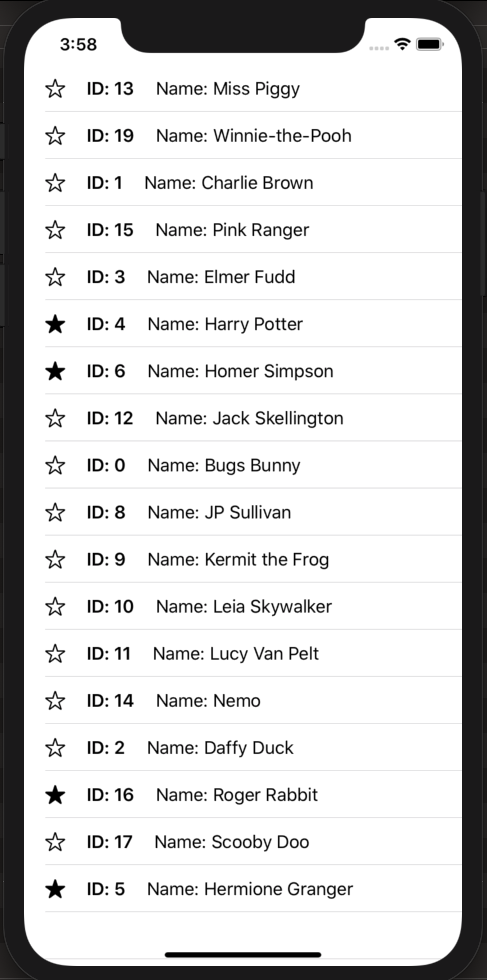

# Simple Combine Network Layer to consume from API


## Description : 

Simple SwiftUI List App to showcase a thin Networking Layer made with Combine

### JSON to Fetch:

```
https://s3.amazonaws.com/technical-challenge/v3/contacts.json
```

### TODO: 
Use Combine to observe properties in different app-screens and states


### Screenshot


